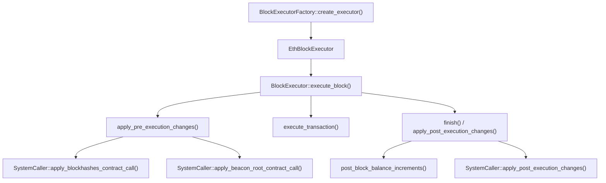

# alloy-evm Ethereum Hardfork 兼容性代码调研文档

本文档详细列出了 alloy-evm 项目中与 Ethereum hardfork 相关的兼容性代码。按照 hardfork 时间顺序（从早到晚）组织，每个 hardfork 章节包含其相关的兼容性代码位置、调用栈、代码片段及 EIP 引用说明。

## 对外接口概览

alloy-evm 通过以下核心接口对外暴露 block 执行能力：



## Frontier

本项目中未发现 Frontier 特定的兼容性代码。Frontier 作为默认的 SpecId，当没有其他 hardfork 激活时使用。

## Homestead

本项目中未发现 Homestead 特定的兼容性代码。EIP-2 相关的 transaction signature 验证在 alloy-consensus 等依赖库中实现。

## DAO Fork

### 不规则状态变更

**调用栈**：
```
BlockExecutorFactory::create_executor()
└── EthBlockExecutor::new()
    └── BlockExecutor::execute_block()
        └── BlockExecutor::apply_post_execution_changes()
            └── EthBlockExecutor::finish()  ← 兼容性代码
```

[crates/evm/src/eth/block.rs:187-205](file:///home/neko/alloy-evm/crates/evm/src/eth/block.rs#L187-L205)

```rust
// Irregular state change at Ethereum DAO hardfork
if self
    .spec
    .ethereum_fork_activation(EthereumHardfork::Dao)
    .transitions_at_block(self.evm.block().number.saturating_to())
{
    // drain balances from hardcoded addresses.
    let drained_balance: u128 = self
        .evm
        .db_mut()
        .drain_balances(dao_fork::DAO_HARDFORK_ACCOUNTS)
        .map_err(|_| BlockValidationError::IncrementBalanceFailed)?
        .into_iter()
        .sum();

    // return balance to DAO beneficiary.
    *balance_increments.entry(dao_fork::DAO_HARDFORK_BENEFICIARY).or_default() +=
        drained_balance;
}
```

**兼容性描述**：处理 TheDAO 事件后的不规则状态变更。在 DAO fork 激活的 block 上，将预定义的 DAO 相关地址中的所有余额转移到 DAO 受益人地址。

**EIP 引用**：DAO Fork（非 EIP） - 2016 年 TheDAO 黑客事件后的硬分叉，用于恢复被盗资金。

## Tangerine Whistle

本项目中未发现 Tangerine Whistle 特定的兼容性代码。EIP-150 相关的 gas 成本调整在 revm 中实现。

## Spurious Dragon

### State Clear Flag

**调用栈**：
```
BlockExecutorFactory::create_executor()
└── EthBlockExecutor::new()
    └── BlockExecutor::execute_block()
        └── EthBlockExecutor::apply_pre_execution_changes()  ← 兼容性代码
```

[crates/evm/src/eth/block.rs:93-96](file:///home/neko/alloy-evm/crates/evm/src/eth/block.rs#L93-L96)

```rust
fn apply_pre_execution_changes(&mut self) -> Result<(), BlockExecutionError> {
    // Set state clear flag if the block is after the Spurious Dragon hardfork.
    let state_clear_flag =
        self.spec.is_spurious_dragon_active_at_block(self.evm.block().number.saturating_to());
    self.evm.db_mut().set_state_clear_flag(state_clear_flag);
    // ...
}
```

**兼容性描述**：在 Spurious Dragon hardfork 激活后设置 state clear flag。该 flag 启用后，空账户（balance、nonce、code 都为零）会在交易执行后被从 state 中移除。

**EIP 引用**：EIP-161（State Trie Clearing）- 清理空账户以减少 state 膨胀。

## Byzantium

### Block Reward 减少（3 ETH）

**调用栈**：
```
BlockExecutorFactory::create_executor()
└── EthBlockExecutor::new()
    └── BlockExecutor::execute_block()
        └── EthBlockExecutor::finish()
            └── state_changes::post_block_balance_increments()
                └── calc::base_block_reward_pre_merge()  ← 兼容性代码
```

[crates/evm/src/block/calc.rs:37-48](file:///home/neko/alloy-evm/crates/evm/src/block/calc.rs#L37-L48)

```rust
pub fn base_block_reward_pre_merge(
    spec: impl EthereumHardforks,
    block_number: BlockNumber,
) -> u128 {
    if spec.is_constantinople_active_at_block(block_number) {
        ETH_TO_WEI * 2
    } else if spec.is_byzantium_active_at_block(block_number) {
        ETH_TO_WEI * 3
    } else {
        ETH_TO_WEI * 5
    }
}
```

**兼容性描述**：Byzantium 将 block reward 从 5 ETH 减少到 3 ETH。

**EIP 引用**：EIP-649（Metropolis Difficulty Bomb Delay and Block Reward Reduction）

## Constantinople / Petersburg

### Block Reward 减少（2 ETH）

**调用栈**：同 Byzantium

[crates/evm/src/block/calc.rs:41-42](file:///home/neko/alloy-evm/crates/evm/src/block/calc.rs#L41-L42)

```rust
if spec.is_constantinople_active_at_block(block_number) {
    ETH_TO_WEI * 2
```

**兼容性描述**：Constantinople 将 block reward 从 3 ETH 减少到 2 ETH。

**EIP 引用**：EIP-1234（Constantinople Difficulty Bomb Delay and Block Reward Adjustment）

## Istanbul

本项目中未发现 Istanbul 特定的兼容性代码。EIP-1884 等 gas 成本调整在 revm 中实现。

## Berlin

本项目中未发现 Berlin 特定的兼容性代码。EIP-2929 等 gas 成本调整在 revm 中实现。

## London

本项目中未发现 London 特定的兼容性代码。EIP-1559 相关的 base fee 计算在 alloy-eips 和 alloy-consensus 中实现。

## Paris（The Merge）

### EVM 环境配置

**调用栈**：
```
EvmEnv::for_eth_block() / EvmEnv::for_eth_next_block()
└── EvmEnv::for_eth()  ← 兼容性代码
```

[crates/evm/src/eth/env.rs:83-94](file:///home/neko/alloy-evm/crates/evm/src/eth/env.rs#L83-L94)

```rust
let is_merge_active = chain_spec.is_paris_active_at_block(input.number);

let block_env = BlockEnv {
    number: U256::from(input.number),
    beneficiary: input.beneficiary,
    timestamp: U256::from(input.timestamp),
    difficulty: if is_merge_active { U256::ZERO } else { input.difficulty },
    prevrandao: if is_merge_active { input.mix_hash } else { None },
    gas_limit: input.gas_limit,
    basefee: input.base_fee_per_gas,
    blob_excess_gas_and_price,
};
```

**兼容性描述**：
- **Post-merge**：`difficulty` 设置为 0，`prevrandao` 使用 `mix_hash` 值
- **Pre-merge**：保持原有的 `difficulty` 值，`prevrandao` 为 None

**EIP 引用**：
- EIP-4399（Supplant DIFFICULTY Opcode with PREVRANDAO）
- EIP-3675（Upgrade Consensus to Proof-of-Stake）

### Block Reward 取消

**调用栈**：
```
BlockExecutorFactory::create_executor()
└── EthBlockExecutor::new()
    └── BlockExecutor::execute_block()
        └── EthBlockExecutor::finish()
            └── state_changes::post_block_balance_increments()
                └── calc::base_block_reward()  ← 兼容性代码
```

[crates/evm/src/block/calc.rs:26-32](file:///home/neko/alloy-evm/crates/evm/src/block/calc.rs#L26-L32)

```rust
pub fn base_block_reward(spec: impl EthereumHardforks, block_number: BlockNumber) -> Option<u128> {
    if spec.is_paris_active_at_block(block_number) {
        None
    } else {
        Some(base_block_reward_pre_merge(spec, block_number))
    }
}
```

**兼容性描述**：Paris（The Merge）后不再有 block reward，返回 `None`。

**EIP 引用**：EIP-3675（Upgrade Consensus to Proof-of-Stake）

## Shanghai

### Withdrawals 余额增量

**调用栈**：
```
BlockExecutorFactory::create_executor()
└── EthBlockExecutor::new()
    └── BlockExecutor::execute_block()
        └── EthBlockExecutor::finish()
            └── state_changes::post_block_balance_increments()
                └── state_changes::insert_post_block_withdrawals_balance_increments()  ← 兼容性代码
```

[crates/evm/src/block/state_changes.rs:89-106](file:///home/neko/alloy-evm/crates/evm/src/block/state_changes.rs#L89-L106)

```rust
pub fn insert_post_block_withdrawals_balance_increments(
    spec: impl EthereumHardforks,
    block_timestamp: u64,
    withdrawals: Option<&[Withdrawal]>,
    balance_increments: &mut HashMap<Address, u128>,
) {
    // Process withdrawals
    if spec.is_shanghai_active_at_timestamp(block_timestamp) {
        if let Some(withdrawals) = withdrawals {
            for withdrawal in withdrawals {
                if withdrawal.amount > 0 {
                    *balance_increments.entry(withdrawal.address).or_default() +=
                        withdrawal.amount_wei().to::<u128>();
                }
            }
        }
    }
}
```

**兼容性描述**：只有在 Shanghai hardfork 激活后才处理 withdrawals，将 validator 提款金额添加到相应地址的余额中。

**EIP 引用**：EIP-4895（Beacon Chain Push Withdrawals as Operations）

## Cancun

### EIP-4788 Beacon Block Root 系统调用

**调用栈**：
```
BlockExecutorFactory::create_executor()
└── EthBlockExecutor::new()
    └── BlockExecutor::execute_block()
        └── EthBlockExecutor::apply_pre_execution_changes()
            └── SystemCaller::apply_beacon_root_contract_call()
                └── eip4788::transact_beacon_root_contract_call()  ← 兼容性代码
```

[crates/evm/src/block/system_calls/eip4788.rs:22-45](file:///home/neko/alloy-evm/crates/evm/src/block/system_calls/eip4788.rs#L22-L45)

```rust
pub(crate) fn transact_beacon_root_contract_call<Halt>(
    spec: impl EthereumHardforks,
    parent_beacon_block_root: Option<B256>,
    evm: &mut impl Evm<HaltReason = Halt>,
) -> Result<Option<ResultAndState<Halt>>, BlockExecutionError> {
    if !spec.is_cancun_active_at_timestamp(evm.block().timestamp.saturating_to()) {
        return Ok(None);
    }

    let parent_beacon_block_root =
        parent_beacon_block_root.ok_or(BlockValidationError::MissingParentBeaconBlockRoot)?;

    // if the block number is zero (genesis block) then the parent beacon block root must
    // be 0x0 and no system transaction may occur as per EIP-4788
    if evm.block().number.is_zero() {
        if !parent_beacon_block_root.is_zero() {
            return Err(BlockValidationError::CancunGenesisParentBeaconBlockRootNotZero {
                parent_beacon_block_root,
            }
            .into());
        }
        return Ok(None);
    }
    // ... execute system call to BEACON_ROOTS_ADDRESS
}
```

**兼容性描述**：在 Cancun hardfork 激活后执行 beacon block root 系统调用，将 parent beacon block root 存储到 `BEACON_ROOTS_ADDRESS`（0x000F3df6D732807Ef1319fB7B8bB8522d0Beac02）合约中。

**EIP 引用**：EIP-4788（Beacon Block Root in the EVM）

## Prague

### EIP-2935 Blockhashes 系统调用

**调用栈**：
```
BlockExecutorFactory::create_executor()
└── EthBlockExecutor::new()
    └── BlockExecutor::execute_block()
        └── EthBlockExecutor::apply_pre_execution_changes()
            └── SystemCaller::apply_blockhashes_contract_call()
                └── eip2935::transact_blockhashes_contract_call()  ← 兼容性代码
```

[crates/evm/src/block/system_calls/eip2935.rs:25-39](file:///home/neko/alloy-evm/crates/evm/src/block/system_calls/eip2935.rs#L25-L39)

```rust
pub(crate) fn transact_blockhashes_contract_call<Halt>(
    spec: impl EthereumHardforks,
    parent_block_hash: B256,
    evm: &mut impl Evm<HaltReason = Halt>,
) -> Result<Option<ResultAndState<Halt>>, BlockExecutionError> {
    if !spec.is_prague_active_at_timestamp(evm.block().timestamp.saturating_to()) {
        return Ok(None);
    }

    // if the block number is zero (genesis block) then no system transaction may occur as per
    // EIP-2935
    if evm.block().number.is_zero() {
        return Ok(None);
    }
    // ... execute system call to HISTORY_STORAGE_ADDRESS
}
```

**兼容性描述**：在 Prague hardfork 激活后执行 blockhashes 系统调用，将 parent block hash 存储到 `HISTORY_STORAGE_ADDRESS`（0x0000F90827F1C53a10CB7A02335B175320002935）合约中，扩展 `BLOCKHASH` 操作码可访问的历史范围。

**EIP 引用**：EIP-2935（Save Historical Block Hashes in State）

### EIP-6110 Deposit Requests

**调用栈**：
```
BlockExecutorFactory::create_executor()
└── EthBlockExecutor::new()
    └── BlockExecutor::execute_block()
        └── BlockExecutor::apply_post_execution_changes()
            └── EthBlockExecutor::finish()  ← 兼容性代码
```

[crates/evm/src/eth/block.rs:159-178](file:///home/neko/alloy-evm/crates/evm/src/eth/block.rs#L159-L178)

```rust
fn finish(
    mut self,
) -> Result<(Self::Evm, BlockExecutionResult<R::Receipt>), BlockExecutionError> {
    let requests = if self
        .spec
        .is_prague_active_at_timestamp(self.evm.block().timestamp.saturating_to())
    {
        // Collect all EIP-6110 deposits
        let deposit_requests =
            eip6110::parse_deposits_from_receipts(&self.spec, &self.receipts)?;

        let mut requests = Requests::default();

        if !deposit_requests.is_empty() {
            requests.push_request_with_type(eip6110::DEPOSIT_REQUEST_TYPE, deposit_requests);
        }

        requests.extend(self.system_caller.apply_post_execution_changes(&mut self.evm)?);
        requests
    } else {
        Requests::default()
    };
    // ...
}
```

**兼容性描述**：在 Prague hardfork 激活后处理 EIP-6110 deposit requests，从执行后的 receipts 中解析 deposit 事件。

**EIP 引用**：EIP-6110（Supply Validator Deposits on Chain）

## Osaka

### Transaction Gas Limit Cap

**调用栈**：
```
EvmEnv::for_eth_block() / EvmEnv::for_eth_next_block()
└── EvmEnv::for_eth()  ← 兼容性代码
```

[crates/evm/src/eth/env.rs:71-73](file:///home/neko/alloy-evm/crates/evm/src/eth/env.rs#L71-L73)

```rust
if chain_spec.is_osaka_active_at_timestamp(input.timestamp) {
    cfg_env.tx_gas_limit_cap = Some(MAX_TX_GAS_LIMIT_OSAKA);
}
```

**兼容性描述**：在 Osaka hardfork 激活后设置 transaction gas limit cap，限制单笔交易的最大 gas limit。

**EIP 引用**：EIP-7825（Transaction Gas Limit Cap）

## 总结

| Hardfork | 主要 EIP | 本项目中的兼容性代码 |
|----------|----------|----------------------|
| Frontier | - | 无特定代码 |
| Homestead | EIP-2 | 无特定代码 |
| DAO Fork | - | 不规则状态变更 |
| Tangerine Whistle | EIP-150 | 无特定代码 |
| Spurious Dragon | EIP-161 | State clear flag |
| Byzantium | EIP-649 | Block reward 3 ETH |
| Constantinople | EIP-1234 | Block reward 2 ETH |
| Istanbul | EIP-1884 | 无特定代码 |
| Berlin | EIP-2929 | 无特定代码 |
| London | EIP-1559 | 无特定代码 |
| Paris | EIP-3675, EIP-4399 | EVM 环境配置、Block reward 取消 |
| Shanghai | EIP-4895 | Withdrawals 处理 |
| Cancun | EIP-4788 | Beacon root 系统调用 |
| Prague | EIP-2935, EIP-6110 | Blockhashes 系统调用、Deposit requests |
| Osaka | EIP-7825 | Transaction gas limit cap |
